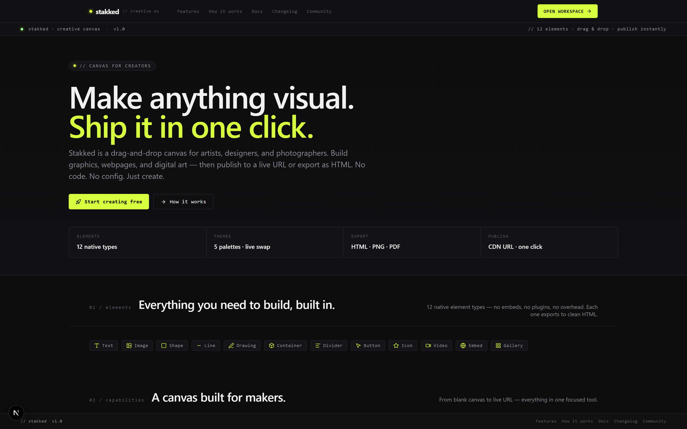
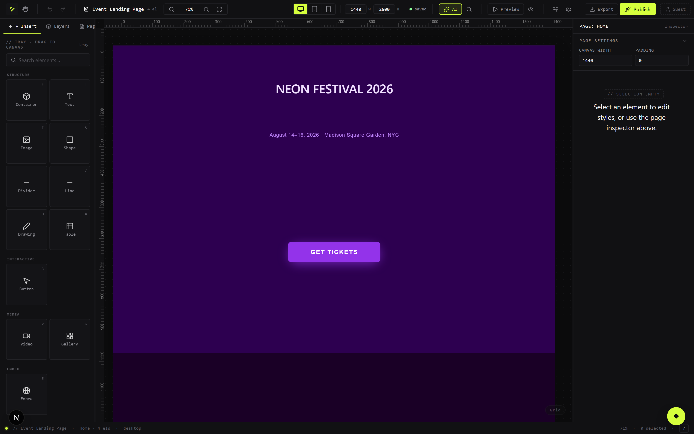
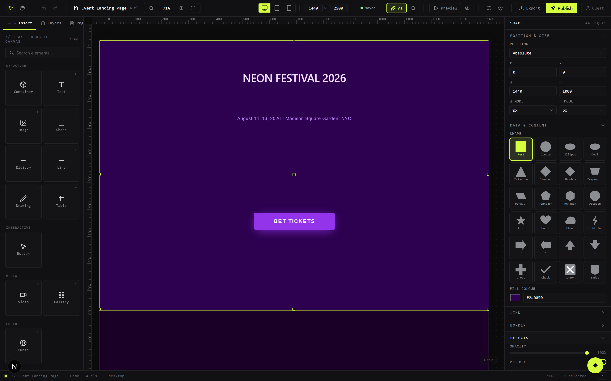
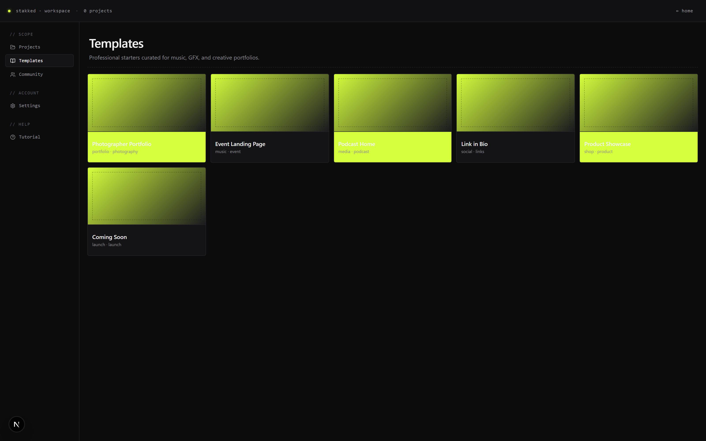

# Stakked

**The visual OS for creators.** A drag-and-drop canvas builder that lets musicians, artists, and brands create stunning interactive pages — without writing code.

> Version 0.3.0 · Built with Next.js 16, React 19, Supabase, and Framer Motion



---

## What Is Stakked?

Stakked is a browser-native page builder designed for the creative industry. Drop in elements, style them with a full properties panel, publish with one click. Everything runs locally first (IndexedDB) with optional cloud sync and auth via Supabase.

**Key capabilities:**
- **Canvas editor** — pixel-precise drag, resize, rotate with multi-select, snap guides, and grouping
- **16 element types** — text, image, button, video, gallery, embed, icon, shape, line, drawing, table, container, divider, progress, countdown, and code
- **Deep properties panel** — typography, multi-layer fill, border, effects, overlays, and transforms per element
- **Responsive design** — per-element desktop / tablet / mobile style overrides
- **Starter templates** — photographer portfolio, event landing page, podcast home, link-in-bio, product showcase, and more, fully pre-built
- **One-click publish** — compiles the canvas to static HTML and deploys to Supabase Storage
- **Community gallery** — browse and fork projects from other creators
- **AI generation** — theme palettes, layout suggestions, and content summaries via Gemini or Groq
- **PWA** — installable, works offline after first load
- **Export** — PNG, JPEG, PDF, GIF, and self-contained HTML

---

## Screenshots

| Canvas editor | Properties panel |
|---|---|
|  |  |

**Starter templates:**



---

## Tech Stack

| Layer | Technology |
|---|---|
| Framework | Next.js 16 (App Router, `--webpack` flag required) |
| UI | React 19 |
| State | Zustand 5 + Immer |
| Animations | Framer Motion 12 |
| Rich text | Tiptap 3 |
| Drag & resize | react-moveable, @dnd-kit |
| Local persistence | IndexedDB via `idb` |
| Cloud | Supabase (Postgres + Storage + Auth) |
| Styling | CSS Modules (no Tailwind) |
| AI | Google Gemini / Groq |
| PWA | @ducanh2912/next-pwa |

---

## Getting Started

### 1. Clone and install

```bash
git clone https://github.com/Tunasmelt/Stakked-v1.git
cd Stakked-v1
npm install
```

### 2. Configure environment variables

```bash
cp .env.example .env.local
```

Open `.env.local` and fill in your values:

```env
# Supabase — required for auth, cloud save, and publish
NEXT_PUBLIC_SUPABASE_URL=https://your-project.supabase.co
NEXT_PUBLIC_SUPABASE_ANON_KEY=your-anon-key

# AI providers — at least one required for AI features
GEMINI_API_KEY=your-gemini-key
GROQ_API_KEY=your-groq-key
AI_DEFAULT_PROVIDER=gemini

# Image search (optional)
PEXELS_API_KEY=your-pexels-key

# Site URL
NEXT_PUBLIC_SITE_URL=http://localhost:3000
```

Stakked runs fully offline without Supabase — auth, cloud sync, and publish will be disabled but the editor works.

### 3. Set up Supabase (optional but recommended)

1. Create a project at [supabase.com](https://supabase.com)
2. Run the migrations in order:

```bash
npx supabase db push
```

Or apply them manually in the SQL Editor:
- `supabase/migrations/20260301000000_init.sql` — tables, indexes, RLS
- `supabase/migrations/20260320000000_fix_rls.sql` — fixes the published_projects policy
- `supabase/migrations/20260321000000_indexes_rpc_rls.sql` — sort indexes + fork_count RPC

3. Create a storage bucket named **`published-html`** (public, 50 MB limit, `text/html` MIME).

### 4. Run the dev server

```bash
npm run dev
```

Open [http://localhost:3000](http://localhost:3000).

> **Important:** Always use `npm run build` (not `npx next build`) — the project uses `@ducanh2912/next-pwa` which is incompatible with Turbopack.

---

## Project Structure

```
src/
  app/                   # Next.js App Router pages and API routes
    api/
      ai/                # AI layout, theme, summary generation
      assets/            # Icons, images, oEmbed proxy
      export/pdf/        # PDF export
      fork/              # Fork count increment (rate-limited)
      publish/           # HTML compile + Supabase Storage upload
    auth/callback/       # OAuth / magic-link PKCE handler
    community/           # Community gallery page
    editor/              # Editor route (wraps Canvas)
    v/[slug]/            # Public viewer + fork redirector
    workspace/           # Project dashboard
  components/
    editor/              # Canvas, CanvasElement, Toolbar, panels
    elements/            # All 16 element renderers
    preview/             # Public-mode PreviewRenderer
    viewer/              # PublicApp wrapper
  data/templates/        # Starter template definitions
  hooks/                 # useInteractivity, useParallax, useAnimationEngine
  lib/
    animation-engine.ts  # Framer Motion trigger/preset builder
    db.ts                # IndexedDB helpers (idb)
    export.ts            # HTML compiler for publish
    rate-limit.ts        # In-memory sliding-window rate limiter
    style-utils.ts       # Responsive style merge (desktop→tablet→mobile)
    supabase.ts          # Supabase client + auth helpers
    sync.ts              # Cloud sync, BroadcastChannel, auto-save
  stores/
    editor-store.ts      # Editor UI state (selection, breakpoint, zoom)
    project-store.ts     # Project data + Immer mutations + history
    ui-store.ts          # Toasts, modals, preview mode
  types/                 # TypeScript interfaces (element, project, style, animation)
supabase/migrations/     # SQL migration files (apply with supabase db push)
```

---

## Available Scripts

| Command | Description |
|---|---|
| `npm run dev` | Start dev server (Next.js + HMR) |
| `npm run build` | Production build (must use this, not `npx next build`) |
| `npm run start` | Start production server |
| `npm run lint` | ESLint check |

---

## Environment Variables Reference

| Variable | Required | Description |
|---|---|---|
| `NEXT_PUBLIC_SUPABASE_URL` | For cloud features | Your Supabase project URL |
| `NEXT_PUBLIC_SUPABASE_ANON_KEY` | For cloud features | Supabase anon/public key |
| `GEMINI_API_KEY` | For AI features | Google Gemini API key |
| `GROQ_API_KEY` | For AI features | Groq API key (alternative to Gemini) |
| `AI_DEFAULT_PROVIDER` | No | `"gemini"` or `"groq"` (default: `gemini`) |
| `PEXELS_API_KEY` | No | Enables the image search panel |
| `NEXT_PUBLIC_SITE_URL` | No | Base URL for published share links |

---

## Publishing a Project

1. Open any project in the editor
2. Click **Go Live** in the toolbar
3. Stakked compiles every page to static HTML and uploads to Supabase Storage
4. Your project is live at `/v/your-slug` and the share URL is copied to clipboard

Published projects are stored in the `published_projects` table with row-level security — only the owner can overwrite their slug.

---

## Offline / Guest Mode

No Supabase account needed to use the editor. Projects are saved to browser IndexedDB automatically. When you sign in later, changes sync to the cloud. Guest projects use a stable anonymous ID stored in `localStorage`.

---

## Contributing

1. Fork this repository
2. Create a feature branch: `git checkout -b feat/your-feature`
3. Follow the code style: CSS Modules only, no `any` types, Framer Motion 12 import paths
4. Run `npm run lint` and `npx tsc --noEmit` before opening a PR
5. Open a pull request against `master`

See `AGENTS.md` for Claude Code project instructions if you use AI assistance.

---

## License

MIT — see `LICENSE` for details.
